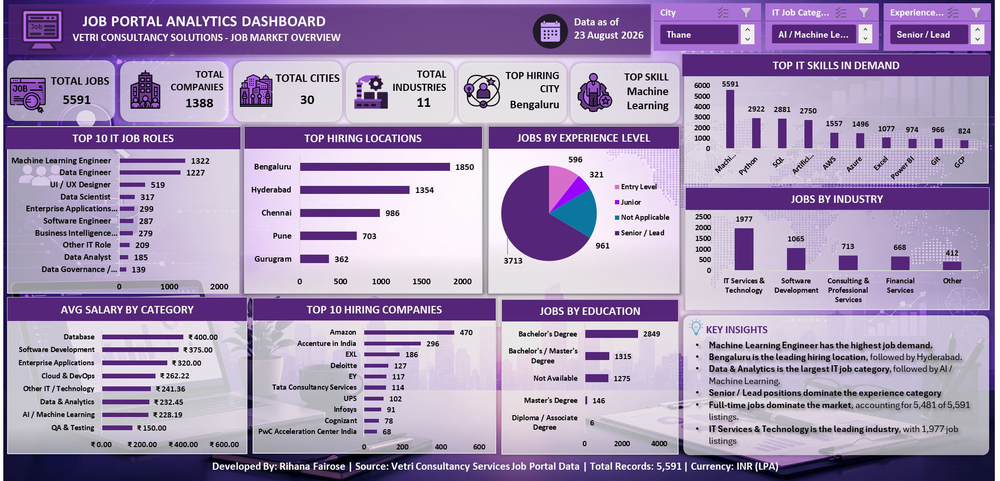
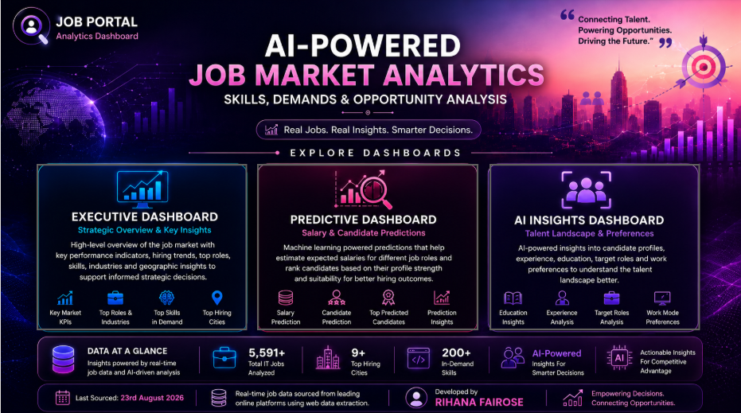
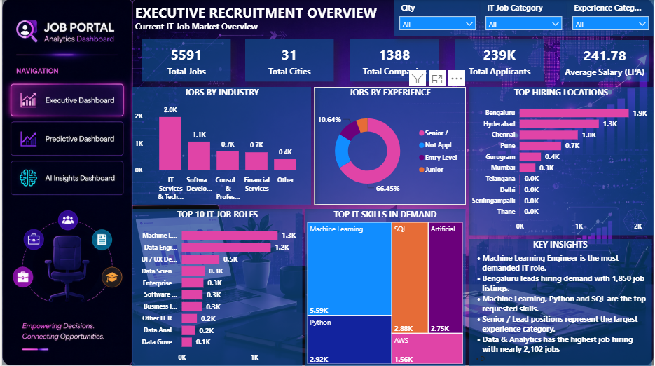
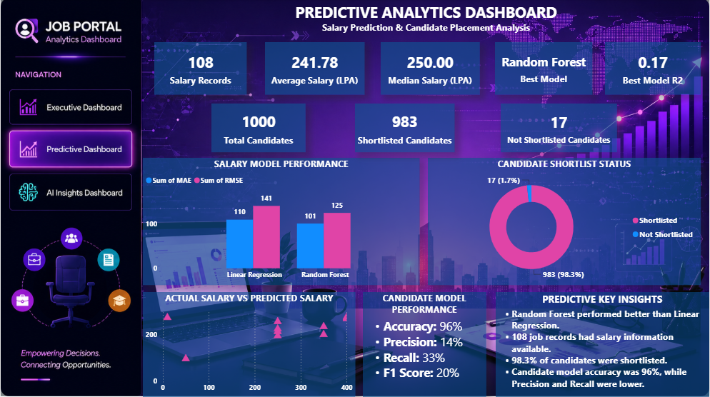
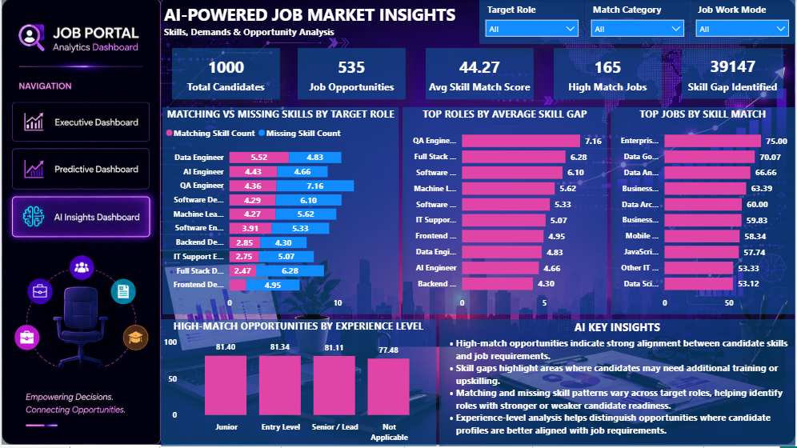
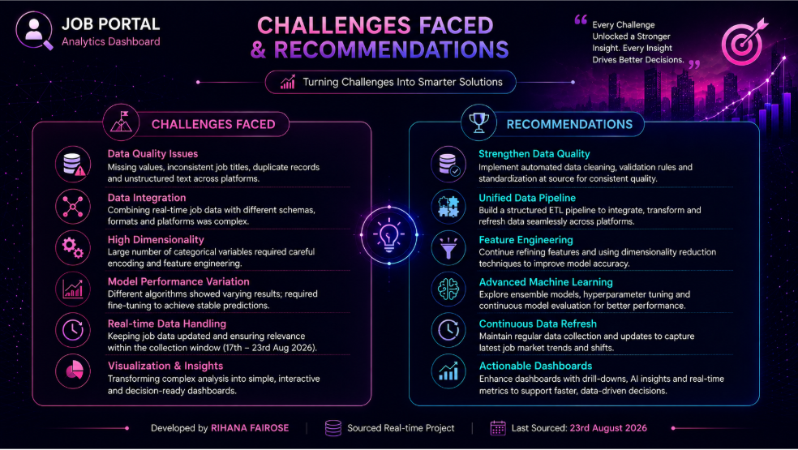
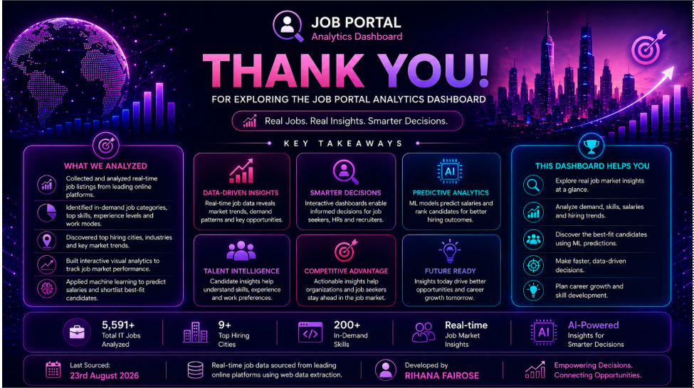

# 📊 Real-Time Job Portal Analysis

## 📌 Project Overview

The **Real-Time Job Portal Analysis** project is an end-to-end data analytics project focused on analyzing IT job-market data to identify trends in job opportunities, job roles, salaries, locations, experience requirements, education, and in-demand skills.

The project demonstrates a complete data analytics workflow, starting from raw job-market data collection and data cleaning through exploratory analysis, SQL analysis, interactive Excel and Power BI dashboards, Python-based analysis, and Machine Learning.

The objective is to transform raw job-market data into meaningful insights that can support job seekers, recruiters, and organizations in understanding current hiring patterns and market requirements.

---

## 🎯 Project Objectives

The main objectives of this project are:

- Analyze IT job-market trends and job opportunities.
- Identify the most frequently available job roles.
- Analyze salary patterns across different job roles and experience levels.
- Identify locations with higher job opportunities.
- Analyze the most in-demand technical and professional skills.
- Understand the relationship between experience, education, skills, and salary.
- Perform structured analysis using SQL.
- Build interactive dashboards using Excel and Power BI.
- Perform additional data analysis using Python.
- Apply Machine Learning techniques for salary prediction and candidate selection analysis.
- Generate actionable business insights and recommendations.

---

## 🗂️ Project Structure

```text
Real_Time_Job_Portal_Analytics
│
├── 01_Datasets
├── 02_Excel
├── 03_SQL
├── 04_Python
├── 05_PowerBI
├── 06_Screenshots
│   ├── 01_PowerBI_Landing_Page.png
│   ├── 02_PowerBI_Dashboard_1.png
│   ├── 03_PowerBI_Dashboard_2.png
│   ├── 04_PowerBI_Dashboard_3.png
│   ├── 05_PowerBI_Challenges_Recommendations.png
│   ├── 06_PowerBI_Thank_You.png
│   └── Excel_Dashboard.png
│
├── Job_Portal_Analytics_Professional_Document
├── Vetri_Consultancy_Job_Portal_Analytics
└── README.md
```

---

## 🛠️ Tools & Technologies

| Tool / Technology | Purpose |
|---|---|
| **Microsoft Excel** | Data analysis, Pivot Tables and dashboard development |
| **Power Query** | Data cleaning and transformation |
| **SQL / MySQL** | Structured data analysis and querying |
| **Power BI** | Interactive dashboard development and visualization |
| **Python** | Data analysis, preprocessing and visualization |
| **Pandas** | Data manipulation and analysis |
| **NumPy** | Numerical analysis |
| **Matplotlib** | Data visualization |
| **Scikit-learn** | Machine Learning |
| **Git & GitHub** | Version control and project portfolio management |

---

## 🔄 Data Analytics Workflow

The project follows an end-to-end analytics workflow:

```text
Raw Job-Market Data
        ↓
Data Cleaning & Transformation
        ↓
Exploratory Data Analysis
        ↓
Excel Analysis
        ↓
SQL Analysis
        ↓
Power BI Data Modeling
        ↓
Interactive Dashboards
        ↓
Python Analysis
        ↓
Machine Learning
        ↓
Business Insights & Recommendations
```

---

## 🧹 Data Cleaning & Preparation

The raw job-market data was cleaned and transformed before analysis.

Key data preparation activities included:

- Removing duplicate records.
- Handling missing and inconsistent values.
- Standardizing categorical fields.
- Cleaning job titles and job-related attributes.
- Preparing salary-related information.
- Organizing skills and job requirements.
- Transforming raw data into analysis-ready datasets.
- Preparing datasets for Excel, SQL, Power BI and Python analysis.

**Power Query** was used for data cleaning and transformation.

---

## 📊 Excel Analysis

Microsoft Excel was used for exploratory analysis, Pivot Table analysis and dashboard development.

### Key Analysis Areas

- Job-role distribution
- Salary analysis
- Experience analysis
- Location analysis
- Skill analysis
- Education analysis
- Job-market trends

### Excel Dashboard

The Excel dashboard provides a consolidated visual view of important job-market metrics and trends.



---

## 🗄️ SQL Analysis

SQL was used to perform structured analysis on the job-market datasets.

### SQL Analysis Included

- Job-role analysis
- Salary analysis
- Location-based analysis
- Experience-based analysis
- Skill analysis
- Aggregation and grouping
- Filtering and sorting
- Business-oriented analytical queries

The SQL analysis and queries are available in the `03_SQL` folder.

---

## 📈 Power BI Dashboard

Power BI was used to transform the cleaned job-market data into interactive dashboards.

The dashboard provides users with the ability to explore job-market information through visualizations, filters and analytical views.

### Key Analysis Areas

- Job opportunities
- Job roles
- Salary distribution
- Job locations
- Experience levels
- Education
- Skills
- Hiring-related trends
- Job-market metrics

---

## 📷 Power BI Dashboard Screenshots

### Power BI Landing Page



### Power BI Dashboard 1



### Power BI Dashboard 2



### Power BI Dashboard 3



### Challenges & Recommendations



### Thank You Page



---

## 🐍 Python Data Analysis

Python was used for additional data exploration, preprocessing, visualization and Machine Learning.

### Python Libraries Used

- Pandas
- NumPy
- Matplotlib
- Scikit-learn

### Python Analysis Included

- Dataset loading and exploration
- Data cleaning
- Data preprocessing
- Descriptive analysis
- Feature preparation
- Data visualization
- Salary analysis
- Candidate profile analysis
- Machine Learning model development

The Python implementation is available in the `04_Python` folder.

---

## 🤖 Machine Learning

Machine Learning techniques were incorporated to explore predictive analytics applications in the recruitment domain.

### 💰 Salary Prediction

Machine Learning models were developed to predict job salaries based on relevant job-related features.

#### Models Evaluated

- Linear Regression
- Random Forest Regression

#### Evaluation Metrics

- Mean Absolute Error (MAE)
- Root Mean Squared Error (RMSE)
- R² Score

### Model Comparison

| Model | MAE | RMSE | R² Score |
|---|---:|---:|---:|
| Linear Regression | 110.11 | 141.26 | -0.06 |
| Random Forest Regression | 101.28 | 125.44 | 0.17 |

Based on the evaluation results, **Random Forest Regression performed better than Linear Regression** for this dataset.

However, the relatively low R² score indicates that the available features explain only a limited portion of salary variation. Additional relevant features and improved data quality could potentially improve predictive performance.

---

## 👤 Candidate Selection Prediction

A candidate-profile dataset was used to explore the possibility of predicting candidate selection outcomes.

A dataset containing **1,000 candidate profiles** was used for this analysis.

### Model Used

**Logistic Regression**

### Evaluation Results

| Metric | Result |
|---|---:|
| Accuracy | 96% |
| Precision | 14% |
| Recall | 33% |
| F1 Score | 20% |

Although the model achieved high overall accuracy, the relatively low precision, recall and F1 score indicate that accuracy alone is not sufficient for evaluating the candidate-selection model.

This highlights the importance of considering multiple evaluation metrics, particularly when working with imbalanced classification problems.

---

## 🔍 Key Business Insights

The analysis provides insights into several aspects of the IT job market, including:

- Distribution of job opportunities across different roles.
- Salary differences across job-related categories.
- Relationship between experience and salary.
- Locations with greater job opportunities.
- Frequently requested technical and professional skills.
- Relationship between education, experience and job opportunities.
- Candidate characteristics associated with selection outcomes.
- Comparative performance of Machine Learning models.

---

## 💡 Business Recommendations

### For Job Seekers

- Focus on skills that frequently appear in job postings.
- Develop relevant technical and analytical skills.
- Understand salary expectations based on role and experience.
- Identify job roles and locations with stronger opportunities.
- Continuously update skills based on changing market requirements.

### For Recruiters

- Use job-market data to understand current talent requirements.
- Monitor demand for specific technical skills.
- Use data-driven approaches to evaluate candidate profiles.
- Consider multiple performance metrics when evaluating candidate-selection models.

### For Organizations

- Monitor changes in skill demand.
- Analyze salary patterns across roles and experience levels.
- Use dashboards to support recruitment and workforce planning.
- Apply data-driven insights to improve hiring strategies.

---

## 📁 Project Files

| Folder | Contents |
|---|---|
| `01_Datasets` | Raw, cleaned and candidate datasets |
| `02_Excel` | Excel analysis and dashboard |
| `03_SQL` | SQL datasets and analytical queries |
| `04_Python` | Python analysis and Machine Learning |
| `05_PowerBI` | Power BI dashboard files |
| `06_Screenshots` | Excel and Power BI dashboard screenshots |

---

## 🎯 Skills Demonstrated

This project demonstrates practical skills in:

- Data Cleaning
- Data Transformation
- Exploratory Data Analysis
- Microsoft Excel
- Power Query
- Pivot Tables
- SQL
- MySQL
- Power BI
- Data Modeling
- Data Visualization
- Python
- Pandas
- NumPy
- Matplotlib
- Machine Learning
- Regression
- Classification
- Model Evaluation
- Business Analysis
- Dashboard Development
- Data Storytelling

---

## 🚀 Project Outcome

This project demonstrates an end-to-end approach to solving a real-world job-market analytics problem.

By combining **Excel, SQL, Power BI, Python and Machine Learning**, the project demonstrates the ability to:

```text
Collect
   ↓
Clean
   ↓
Transform
   ↓
Analyze
   ↓
Visualize
   ↓
Predict
   ↓
Generate Business Insights
```

The project showcases how multiple analytics tools can be integrated to convert raw job-market data into actionable insights and interactive business intelligence dashboards.

---

## 👩‍💻 Author

**Rihana Fairose**

Data Analytics | Excel | SQL | Power BI | Python | Machine Learning

---

⭐ If you find this project useful or interesting, feel free to explore the project files and dashboards.
