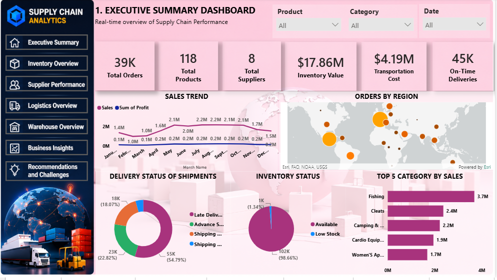
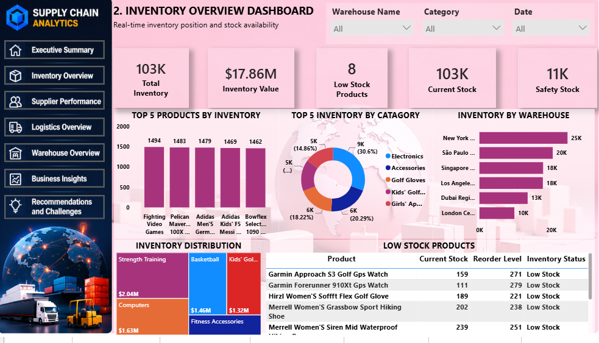
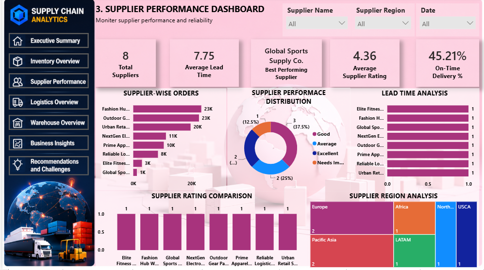
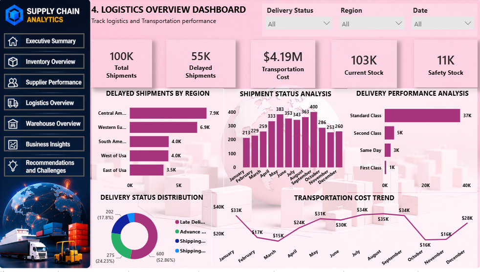
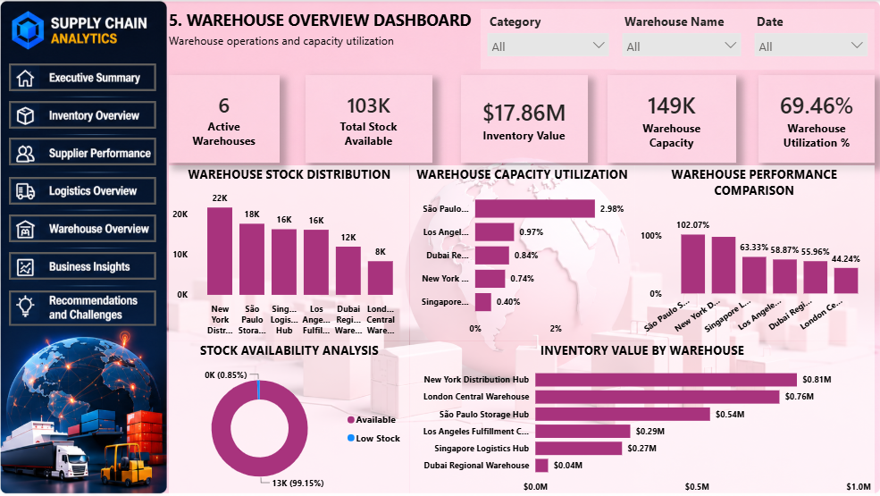
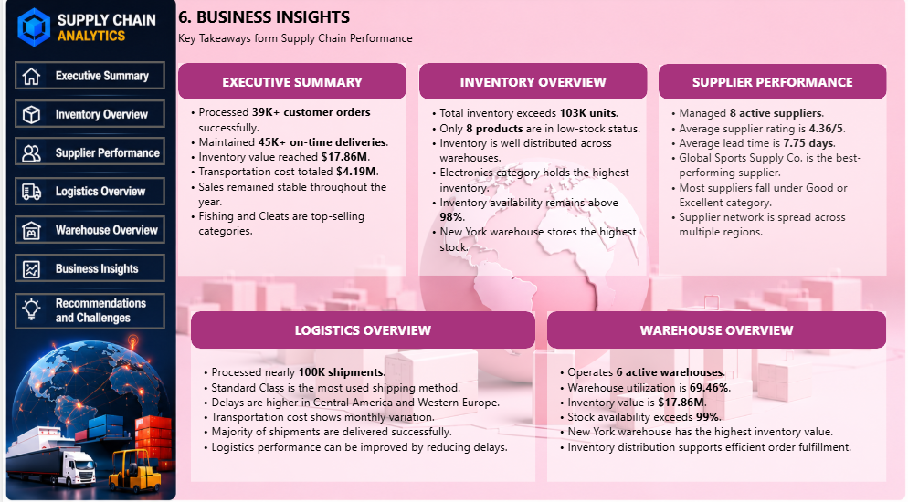
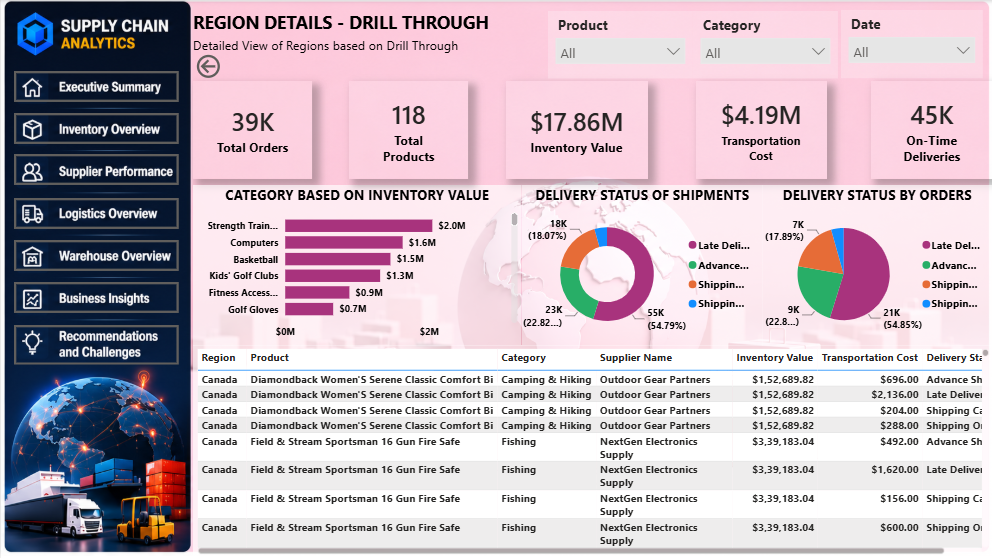
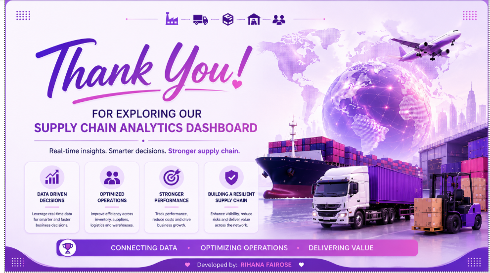

# 📦 Supply Chain Analytics Dashboard

## 📌 Project Overview

The **Supply Chain Analytics Dashboard** is an end-to-end data analytics
project developed using **Microsoft Power BI, Power Query, DAX, and
Excel/CSV data**.

The project focuses on analyzing **inventory, suppliers, orders,
warehouses, shipments, logistics, and regional performance**.

The objective is to transform raw supply chain data into an interactive
business intelligence solution that helps organizations monitor
operational performance, identify inefficiencies, and support
data-driven decision-making.

------------------------------------------------------------------------

## 🎯 Project Objectives

-   Analyze overall supply chain performance.
-   Monitor inventory levels and stock-related metrics.
-   Evaluate supplier performance.
-   Analyze order and shipment activity.
-   Identify logistics and delivery patterns.
-   Compare warehouse performance.
-   Analyze regional supply chain activity.
-   Identify operational challenges and improvement areas.
-   Build an interactive Power BI dashboard.
-   Generate actionable business insights and recommendations.

------------------------------------------------------------------------

## 🗂️ Project Structure

``` text
Supply_Chain_Analytics_Dashboard/
│
├── 01_Dataset/
│   ├── Original Dataset
│   ├── Latest 100000 Rows Dataset
│   └── Cleaned Dataset/
│       └── SupplyChain_Final_Cleaned_PowerBI_Ready.csv
│
├── 02_PowerBI/
│   └── Supply_Chain_Analytics_Dashboard.pbix
│
├── 03_DAX/
│   └── DAX calculations used in this project.docx
│
├── 04_Screenshots/
│   ├── Landing_Page_01.png
│   ├── Executive_Summary_02.png
│   ├── Inventory_03.png
│   ├── Supplier_Performance_04.png
│   ├── Logistics_Overview_05.png
│   ├── Warehouse_Overview_06.png
│   ├── Business_Insights_07.png
│   ├── Recommendations_Challenges_08.png
│   ├── Region_Details_09.png
│   └── Thank_you_10.png
│
└── 05_Documentation/
    ├── Supply_Chain_Analytics_Project_Report.docx
    └── Supply_Chain_Analytics_Project_Report.pdf
```

------------------------------------------------------------------------

## 🛠️ Tools & Technologies

  -----------------------------------------------------------------------
  Tool / Technology                   Purpose
  ----------------------------------- -----------------------------------
  **Microsoft Power BI**              Interactive dashboard development
                                      and visualization

  **Power Query**                     Data cleaning and transformation

  **DAX**                             Measures, KPIs and analytical
                                      calculations

  **Microsoft Excel / CSV**           Data preparation and analysis

  **Git & GitHub**                    Version control and project
                                      portfolio management
  -----------------------------------------------------------------------

------------------------------------------------------------------------

## 🔄 Data Analytics Workflow

``` text
Raw Supply Chain Data
        ↓
Data Cleaning
        ↓
Data Transformation
        ↓
Data Preparation
        ↓
Data Modeling
        ↓
DAX Calculations
        ↓
Power BI Visualization
        ↓
Business Analysis
        ↓
Insights & Recommendations
```

------------------------------------------------------------------------

## 📊 Dataset

The project includes multiple versions of the dataset to document the
data preparation process.

-   **Original Dataset** -- source dataset retained for reference.
-   **Latest 100000 Rows Dataset** -- reduced dataset used for practical
    project development.
-   **Cleaned Power BI Ready Dataset** -- transformed dataset prepared
    for dashboard development.

The data preparation process includes cleaning, transformation,
formatting, and preparation of fields required for Power BI analysis.

------------------------------------------------------------------------

# 📈 Power BI Dashboard

The Power BI solution contains multiple analytical pages designed to
provide different views of supply chain performance.

## 🏠 Landing Page

The landing page provides navigation to the major dashboard sections.


## 📋 Executive Summary

Provides a high-level overview of important supply chain KPIs and
overall business performance.



## 📦 Inventory Overview

Analyzes inventory-related performance and helps identify stock levels
and inventory trends.



## 🤝 Supplier Performance

Evaluates supplier-related performance and supports comparison using
relevant operational metrics.



## 🚚 Logistics Overview

Analyzes shipment and logistics performance, helping identify delivery
patterns and operational trends.



## 🏭 Warehouse Overview

Provides insights into warehouse-level activity and performance.



## 💡 Business Insights

Highlights important findings identified through dashboard analysis.



## ⚠️ Challenges & Recommendations

Summarizes major operational challenges and provides data-driven
recommendations.


## 🌍 Regional Details

Provides a regional view of supply chain activity and performance.



## 🙏 Thank You

Final dashboard page.



------------------------------------------------------------------------

# 📌 Key Analysis Areas

-   Inventory Management
-   Supplier Performance
-   Order Management
-   Shipment & Logistics
-   Warehouse Performance
-   Regional Performance
-   Operational KPIs
-   Supply Chain Efficiency
-   Business Insights
-   Recommendations

------------------------------------------------------------------------

# 📐 DAX & KPI Analysis

DAX was used to create analytical measures and KPIs required for the
dashboard.

The DAX calculations are documented separately in:

**`03_DAX/DAX calculations used in this project.docx`**

These calculations support KPI cards, charts, comparisons, and
analytical views.

------------------------------------------------------------------------

# 📊 Dashboard Features

-   Interactive KPI cards
-   Filters and slicers
-   Comparative analysis
-   Category-level analysis
-   Supplier analysis
-   Inventory analysis
-   Warehouse analysis
-   Logistics analysis
-   Regional analysis
-   Business insights
-   Recommendations

------------------------------------------------------------------------

# 💡 Business Value

This project demonstrates how data analytics and business intelligence
can support supply chain decision-making.

The dashboard can help stakeholders:

-   Monitor important operational KPIs.
-   Identify inventory-related issues.
-   Compare supplier performance.
-   Understand logistics and shipment patterns.
-   Evaluate warehouse activity.
-   Identify regional differences.
-   Discover operational improvement opportunities.
-   Make more informed business decisions.

------------------------------------------------------------------------

# 📚 Documentation

Detailed project documentation is available in the
**`05_Documentation`** folder and includes the project report in DOCX
and PDF formats.

------------------------------------------------------------------------

# 👩‍💻 Author

**Rihana Fairose**

**Data Analytics \| Excel \| Power BI \| Power Query \| DAX \| SQL \|
Python \| Machine Learning**

------------------------------------------------------------------------

## ⭐ Project Outcome

This project demonstrates an end-to-end **Supply Chain Analytics and
Business Intelligence workflow**, from raw data preparation through
transformation, modeling, DAX analysis, visualization, and business
insight generation.

The final Power BI dashboard provides an interactive and structured view
of supply chain operations and demonstrates practical data analytics
skills using industry-relevant tools.

------------------------------------------------------------------------

⭐ **If you find this project useful or interesting, feel free to
explore the project files and dashboard screenshots.**
